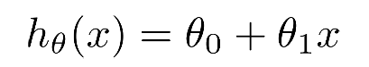
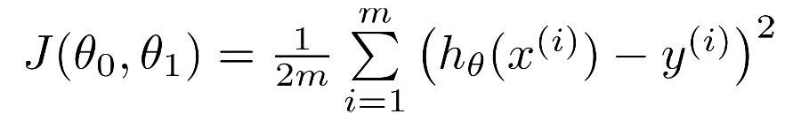
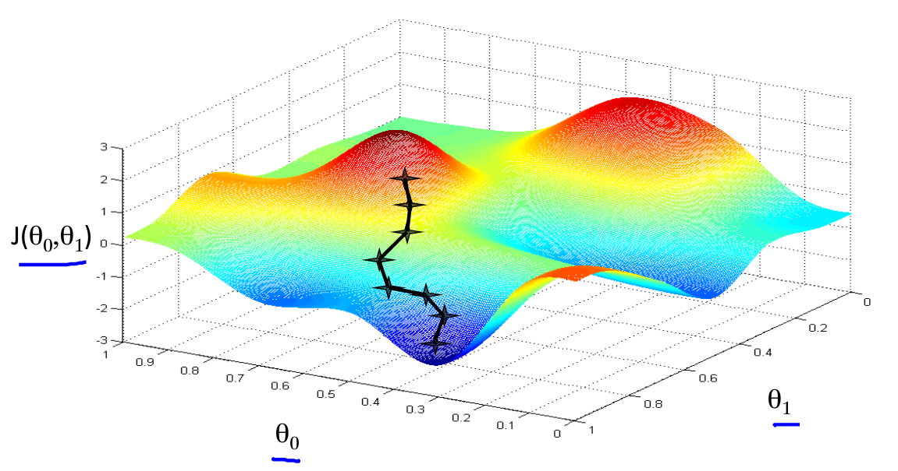
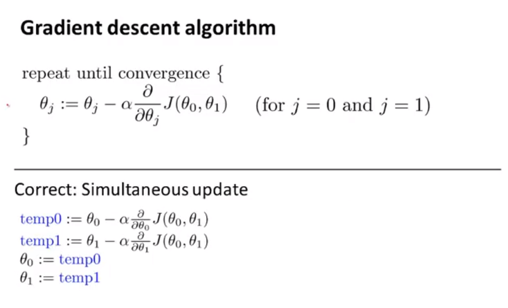
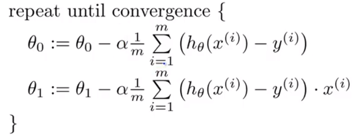
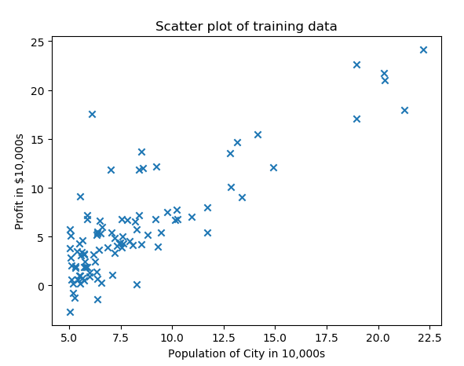
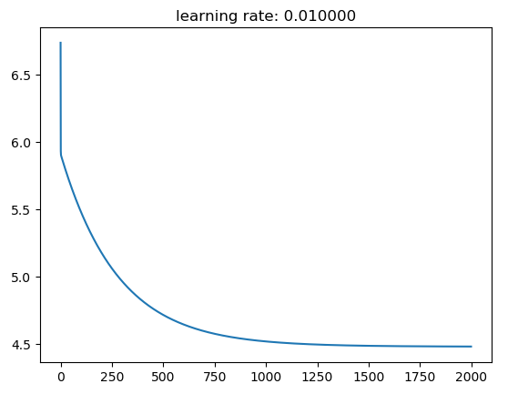

# 单变量线性回归

## 模型
给一个数据集，里面有每一个样本的"正确答案"，需要通过学习出一个模型(hypothesis)，这个模型表现了数据集中x和y的对应关系。假设一个模型的表现形式为：  
  
其中 $\theta_{0}$ 、 $\theta_{1}$ 表示参数，根据参数的不同，h(x)的表达也不同，那怎么样去找到最合适的参数，使模型对数据的拟合度更高呢？

## 代价函数

为了让模型对数据的拟合度更高，我们定义了代价函数：选择合适的 $\theta_{0}$ 、 $\theta_{1}$ 让 $h(x)$ 在数据集 $(x,y)$ 上与 $y$ 更接近
代价函数定义为：  
  
目标即是求 $min (J(\theta_{0}, \theta_{1}))$

## 梯度下降
在求解损失函数的最小值时，可以通过梯度下降法来一步步的迭代求解，得到最小化的损失函数和模型参数值。  
  
想象在一个山顶，每一次都沿着下坡的方向往下走，最终就能走到山底。梯度下降就是通过一次次的迭代，沿着函数值变小的方向，最终得到一个局部最优解，并得出参数的值：  
  

结合以上信息，我们可以得出线性回归的梯度下降方法：  
  

## 练习

练习内容来自 https://www.coursera.org/learn/machine-learning ex1.

### 1  Plotting the Data
> `code` : scatter_plot.py  

>   

### 2 Gradient Descent

> `code` : compute_cost.py gradient_descent.py

> 迭代次数为1500，学习速度α为0.01，数据集为ex1data1时的收敛情况如下图所示：  
> 
>   